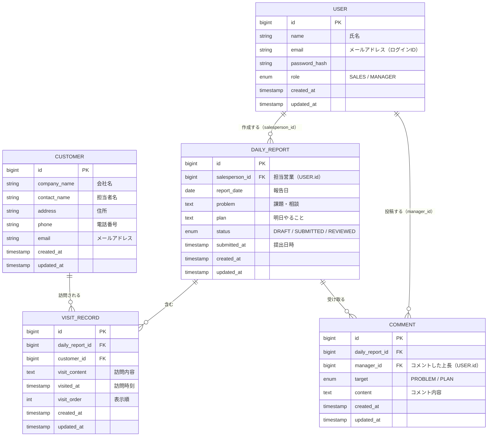

# 営業日報システム

# ドキュメント参照

以下のドキュメントは、関連する画面・API・テストの実装や修正を行う際に参照すること。

- 画面の実装・修正時: @docs/SCREEN_DESIGN.md
- APIの実装・修正時: @docs/API_SCHEME.md
- テストの実装・修正時: @docs/TEST_DEFINITION.md

## 要件定義

### アクター

| アクター | 説明 |
| --- | --- |
| 営業担当者 | 日報を作成・提出する |
| 上長（マネージャー） | 全営業の日報を閲覧し、Problem・Plan にコメントする |

### 機能要件

#### 日報管理

- 営業担当者は 1日1件 の日報を作成できる（担当者 × 日付でユニーク）
- ステータス：DRAFT（下書き） → SUBMITTED（提出済み） → REVIEWED（確認済み）

#### 訪問記録

- 1つの日報に対して、訪問した顧客とその内容を複数件登録できる
- 顧客は顧客マスタから選択する

#### Problem / Plan

- 日報に「今の課題・相談（Problem）」と「明日やること（Plan）」をテキストで記述する
- 上長は Problem・Plan それぞれに対してコメントを複数件投稿できる

#### マスタ管理

- 顧客マスタ（CUSTOMER）: 顧客の基本情報を管理する
- ユーザーマスタ（USER）: 営業担当者・上長を role で区別して管理する

### 制約・権限

- ユーザーはメールアドレス + パスワードでログインする
- 日報の閲覧：本人および上長（ロール MANAGER）は全件閲覧可能
- コメント投稿：上長（ロール MANAGER）のみ可能

## ER図

