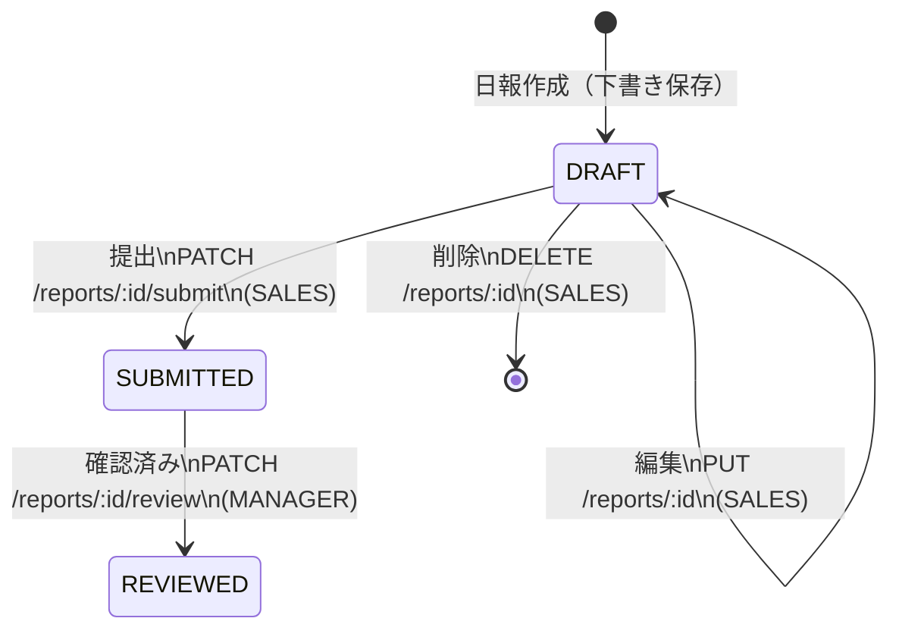

# API仕様書 — 営業日報システム

## 共通仕様

### ベースURL

```
/api/v1
```

### リクエスト形式

- Content-Type: `application/json`
- 文字コード: UTF-8

### 認証方式

- JWT（JSON Web Token）によるBearer認証
- ログインAPI以外のすべてのエンドポイントで `Authorization` ヘッダーが必要

```
Authorization: Bearer <token>
```

### 共通レスポンス形式

**成功時**

```json
{
  "data": { ... }
}
```

**一覧取得時（ページネーション付き）**

```json
{
  "data": [ ... ],
  "pagination": {
    "current_page": 1,
    "per_page": 20,
    "total_count": 100,
    "total_pages": 5
  }
}
```

**エラー時**

```json
{
  "error": {
    "code": "VALIDATION_ERROR",
    "message": "入力内容に誤りがあります",
    "details": [
      {
        "field": "email",
        "message": "メール形式で入力してください"
      }
    ]
  }
}
```

### 共通エラーコード

| HTTPステータス | エラーコード | 説明 |
| --- | --- | --- |
| 400 | `VALIDATION_ERROR` | バリデーションエラー |
| 401 | `UNAUTHORIZED` | 未認証（トークンなし・期限切れ） |
| 403 | `FORBIDDEN` | アクセス権限なし |
| 404 | `NOT_FOUND` | リソースが見つからない |
| 409 | `CONFLICT` | リソースの競合（重複など） |
| 500 | `INTERNAL_SERVER_ERROR` | サーバー内部エラー |

### 日付・時刻フォーマット

| 型 | フォーマット | 例 |
| --- | --- | --- |
| date | `YYYY-MM-DD` | `2025-05-20` |
| datetime | ISO 8601 | `2025-05-20T18:00:00+09:00` |
| time | `HH:mm` | `10:00` |

---

## API一覧

| No. | メソッド | エンドポイント | 概要 | 認証 | 権限 |
| --- | --- | --- | --- | --- | --- |
| 1 | POST | `/auth/login` | ログイン | 不要 | — |
| 2 | POST | `/auth/logout` | ログアウト | 必要 | ALL |
| 3 | GET | `/auth/me` | ログインユーザー情報取得 | 必要 | ALL |
| 4 | GET | `/reports` | 日報一覧取得 | 必要 | ALL |
| 5 | POST | `/reports` | 日報作成 | 必要 | SALES |
| 6 | GET | `/reports/:id` | 日報詳細取得 | 必要 | ALL |
| 7 | PUT | `/reports/:id` | 日報更新 | 必要 | SALES |
| 8 | DELETE | `/reports/:id` | 日報削除 | 必要 | SALES |
| 9 | PATCH | `/reports/:id/submit` | 日報提出 | 必要 | SALES |
| 10 | PATCH | `/reports/:id/review` | 日報確認済み | 必要 | MANAGER |
| 11 | POST | `/reports/:id/comments` | コメント投稿 | 必要 | MANAGER |
| 12 | GET | `/customers` | 顧客一覧取得 | 必要 | ALL |
| 13 | POST | `/customers` | 顧客登録 | 必要 | ALL |
| 14 | GET | `/customers/:id` | 顧客詳細取得 | 必要 | ALL |
| 15 | PUT | `/customers/:id` | 顧客更新 | 必要 | ALL |
| 16 | DELETE | `/customers/:id` | 顧客削除 | 必要 | ALL |
| 17 | GET | `/users` | ユーザー一覧取得 | 必要 | MANAGER |

---

## 1. 認証API

### 1.1 POST `/auth/login` — ログイン

メールアドレスとパスワードで認証し、JWTトークンを返す。

**リクエスト**

| パラメータ | 型 | 必須 | 説明 |
| --- | --- | --- | --- |
| `email` | string | ○ | メールアドレス |
| `password` | string | ○ | パスワード |

```json
{
  "email": "tanaka@example.com",
  "password": "password123"
}
```

**レスポンス（200 OK）**

```json
{
  "data": {
    "token": "eyJhbGciOiJIUzI1NiIs...",
    "user": {
      "id": 1,
      "name": "田中太郎",
      "email": "tanaka@example.com",
      "role": "SALES"
    }
  }
}
```

**エラー（401 Unauthorized）**

```json
{
  "error": {
    "code": "UNAUTHORIZED",
    "message": "メールアドレスまたはパスワードが正しくありません"
  }
}
```

---

### 1.2 POST `/auth/logout` — ログアウト

現在のトークンを無効化する。

**リクエスト**

パラメータなし。

**レスポンス（204 No Content）**

レスポンスボディなし。

---

### 1.3 GET `/auth/me` — ログインユーザー情報取得

現在ログインしているユーザーの情報を返す。ヘッダーへのユーザー名・ロール表示に使用する。

**リクエスト**

パラメータなし。

**レスポンス（200 OK）**

```json
{
  "data": {
    "id": 1,
    "name": "田中太郎",
    "email": "tanaka@example.com",
    "role": "SALES"
  }
}
```

---

## 2. 日報API

### 2.1 GET `/reports` — 日報一覧取得

日報の一覧を取得する。SALES ロールは自分の日報のみ、MANAGER ロールは全件取得可能。

**クエリパラメータ**

| パラメータ | 型 | 必須 | デフォルト | 説明 |
| --- | --- | --- | --- | --- |
| `date_from` | date | — | 当月1日 | 報告日の開始日 |
| `date_to` | date | — | 本日 | 報告日の終了日 |
| `salesperson_id` | integer | — | — | 担当者ID（MANAGER のみ有効） |
| `status` | string | — | — | ステータス絞り込み（`DRAFT` / `SUBMITTED` / `REVIEWED`） |
| `sort` | string | — | `report_date` | ソート項目（`report_date` / `salesperson_name` / `visit_count` / `status` / `submitted_at`） |
| `order` | string | — | `desc` | ソート順（`asc` / `desc`） |
| `page` | integer | — | 1 | ページ番号 |
| `per_page` | integer | — | 20 | 1ページあたりの件数（上限100） |

**レスポンス（200 OK）**

```json
{
  "data": [
    {
      "id": 1,
      "report_date": "2025-05-20",
      "salesperson": {
        "id": 1,
        "name": "田中太郎"
      },
      "visit_count": 3,
      "status": "SUBMITTED",
      "submitted_at": "2025-05-20T18:00:00+09:00"
    }
  ],
  "pagination": {
    "current_page": 1,
    "per_page": 20,
    "total_count": 50,
    "total_pages": 3
  }
}
```

---

### 2.2 POST `/reports` — 日報作成

新規日報を作成する。訪問記録を含めて一括で登録する。

**リクエスト**

| パラメータ | 型 | 必須 | 説明 |
| --- | --- | --- | --- |
| `report_date` | date | ○ | 報告日（未来日不可） |
| `problem` | string | — | 課題・相談（最大2000文字） |
| `plan` | string | — | 明日やること（最大2000文字） |
| `status` | string | ○ | `DRAFT` または `SUBMITTED` |
| `visit_records` | array | — | 訪問記録の配列 |
| `visit_records[].customer_id` | integer | ○ | 顧客ID |
| `visit_records[].visit_content` | string | ○ | 訪問内容（最大1000文字） |
| `visit_records[].visited_at` | time | ○ | 訪問時刻 |

```json
{
  "report_date": "2025-05-20",
  "problem": "納期の調整が必要。先方から短縮の要望あり。",
  "plan": "○○株式会社への見積り再作成。",
  "status": "DRAFT",
  "visit_records": [
    {
      "customer_id": 1,
      "visit_content": "新規提案の打合せ",
      "visited_at": "10:00"
    },
    {
      "customer_id": 2,
      "visit_content": "契約更新の確認",
      "visited_at": "14:00"
    }
  ]
}
```

**レスポンス（201 Created）**

```json
{
  "data": {
    "id": 1,
    "report_date": "2025-05-20",
    "salesperson": {
      "id": 1,
      "name": "田中太郎"
    },
    "problem": "納期の調整が必要。先方から短縮の要望あり。",
    "plan": "○○株式会社への見積り再作成。",
    "status": "DRAFT",
    "submitted_at": null,
    "visit_records": [
      {
        "id": 1,
        "customer": {
          "id": 1,
          "company_name": "○○株式会社"
        },
        "visit_content": "新規提案の打合せ",
        "visited_at": "10:00",
        "visit_order": 1
      },
      {
        "id": 2,
        "customer": {
          "id": 2,
          "company_name": "△△商事"
        },
        "visit_content": "契約更新の確認",
        "visited_at": "14:00",
        "visit_order": 2
      }
    ],
    "comments": [],
    "created_at": "2025-05-20T17:00:00+09:00",
    "updated_at": "2025-05-20T17:00:00+09:00"
  }
}
```

**バリデーション**

| 条件 | エラーコード | メッセージ |
| --- | --- | --- |
| 報告日が未来日 | `VALIDATION_ERROR` | 「報告日に未来の日付は指定できません」 |
| 同日の日報が既に存在 | `CONFLICT` | 「指定された日付の日報は既に存在します」 |
| SUBMITTED 時に訪問記録の必須項目が未入力 | `VALIDATION_ERROR` | 各フィールドのバリデーションメッセージ |

---

### 2.3 GET `/reports/:id` — 日報詳細取得

日報の詳細情報を訪問記録・コメントを含めて取得する。

**パスパラメータ**

| パラメータ | 型 | 説明 |
| --- | --- | --- |
| `id` | integer | 日報ID |

**レスポンス（200 OK）**

```json
{
  "data": {
    "id": 1,
    "report_date": "2025-05-20",
    "salesperson": {
      "id": 1,
      "name": "田中太郎"
    },
    "problem": "納期の調整が必要。先方から短縮の要望あり。",
    "plan": "○○株式会社への見積り再作成。△△商事のフォローアップ。",
    "status": "SUBMITTED",
    "submitted_at": "2025-05-20T18:00:00+09:00",
    "visit_records": [
      {
        "id": 1,
        "customer": {
          "id": 1,
          "company_name": "○○株式会社",
          "contact_name": "山田花子"
        },
        "visit_content": "新規提案の打合せ",
        "visited_at": "10:00",
        "visit_order": 1
      },
      {
        "id": 2,
        "customer": {
          "id": 2,
          "company_name": "△△商事",
          "contact_name": "佐藤次郎"
        },
        "visit_content": "契約更新の確認",
        "visited_at": "14:00",
        "visit_order": 2
      }
    ],
    "comments": [
      {
        "id": 1,
        "target": "PROBLEM",
        "manager": {
          "id": 10,
          "name": "鈴木部長"
        },
        "content": "一度先方と再調整しましょう。",
        "created_at": "2025-05-20T19:30:00+09:00"
      },
      {
        "id": 2,
        "target": "PROBLEM",
        "manager": {
          "id": 10,
          "name": "鈴木部長"
        },
        "content": "明日の会議で議題に上げます。",
        "created_at": "2025-05-21T09:00:00+09:00"
      }
    ],
    "created_at": "2025-05-20T17:00:00+09:00",
    "updated_at": "2025-05-20T18:00:00+09:00"
  }
}
```

**アクセス制御**

- SALES ロール: 自分の日報のみ閲覧可能（他人の日報は `403 Forbidden`）
- MANAGER ロール: 全件閲覧可能

---

### 2.4 PUT `/reports/:id` — 日報更新

既存の日報を更新する。訪問記録は洗い替え（全件削除→再登録）で処理する。

**パスパラメータ**

| パラメータ | 型 | 説明 |
| --- | --- | --- |
| `id` | integer | 日報ID |

**リクエスト**

POST `/reports` と同一のリクエストボディ。

**レスポンス（200 OK）**

POST `/reports` と同一のレスポンス形式。

**制約**

| 条件 | エラーコード | メッセージ |
| --- | --- | --- |
| ステータスが DRAFT 以外 | `FORBIDDEN` | 「提出済みの日報は編集できません」 |
| 本人以外が更新 | `FORBIDDEN` | 「自分の日報のみ編集できます」 |

---

### 2.5 DELETE `/reports/:id` — 日報削除

日報を削除する。関連する訪問記録・コメントも削除される。

**パスパラメータ**

| パラメータ | 型 | 説明 |
| --- | --- | --- |
| `id` | integer | 日報ID |

**レスポンス（204 No Content）**

レスポンスボディなし。

**制約**

| 条件 | エラーコード | メッセージ |
| --- | --- | --- |
| ステータスが DRAFT 以外 | `FORBIDDEN` | 「提出済みの日報は削除できません」 |
| 本人以外が削除 | `FORBIDDEN` | 「自分の日報のみ削除できます」 |

---

### 2.6 PATCH `/reports/:id/submit` — 日報提出

日報のステータスを DRAFT → SUBMITTED に変更する。

**パスパラメータ**

| パラメータ | 型 | 説明 |
| --- | --- | --- |
| `id` | integer | 日報ID |

**リクエスト**

パラメータなし。

**レスポンス（200 OK）**

```json
{
  "data": {
    "id": 1,
    "status": "SUBMITTED",
    "submitted_at": "2025-05-20T18:00:00+09:00"
  }
}
```

**制約**

| 条件 | エラーコード | メッセージ |
| --- | --- | --- |
| ステータスが DRAFT 以外 | `CONFLICT` | 「下書きの日報のみ提出できます」 |
| 本人以外が提出 | `FORBIDDEN` | 「自分の日報のみ提出できます」 |

---

### 2.7 PATCH `/reports/:id/review` — 日報確認済み

日報のステータスを SUBMITTED → REVIEWED に変更する。

**パスパラメータ**

| パラメータ | 型 | 説明 |
| --- | --- | --- |
| `id` | integer | 日報ID |

**リクエスト**

パラメータなし。

**レスポンス（200 OK）**

```json
{
  "data": {
    "id": 1,
    "status": "REVIEWED"
  }
}
```

**制約**

| 条件 | エラーコード | メッセージ |
| --- | --- | --- |
| ステータスが SUBMITTED 以外 | `CONFLICT` | 「提出済みの日報のみ確認済みにできます」 |
| MANAGER ロール以外 | `FORBIDDEN` | 「上長のみ確認済みにできます」 |

---

## 3. コメントAPI

### 3.1 POST `/reports/:id/comments` — コメント投稿

日報の Problem または Plan に対してコメントを投稿する。

**パスパラメータ**

| パラメータ | 型 | 説明 |
| --- | --- | --- |
| `id` | integer | 日報ID |

**リクエスト**

| パラメータ | 型 | 必須 | 説明 |
| --- | --- | --- | --- |
| `target` | string | ○ | コメント対象（`PROBLEM` / `PLAN`） |
| `content` | string | ○ | コメント内容（最大1000文字） |

```json
{
  "target": "PROBLEM",
  "content": "一度先方と再調整しましょう。"
}
```

**レスポンス（201 Created）**

```json
{
  "data": {
    "id": 1,
    "target": "PROBLEM",
    "manager": {
      "id": 10,
      "name": "鈴木部長"
    },
    "content": "一度先方と再調整しましょう。",
    "created_at": "2025-05-20T19:30:00+09:00"
  }
}
```

**制約**

| 条件 | エラーコード | メッセージ |
| --- | --- | --- |
| MANAGER ロール以外 | `FORBIDDEN` | 「上長のみコメントを投稿できます」 |
| ステータスが DRAFT | `FORBIDDEN` | 「下書きの日報にはコメントできません」 |

---

## 4. 顧客API

### 4.1 GET `/customers` — 顧客一覧取得

顧客マスタの一覧を取得する。

**クエリパラメータ**

| パラメータ | 型 | 必須 | デフォルト | 説明 |
| --- | --- | --- | --- | --- |
| `company_name` | string | — | — | 会社名（部分一致検索） |
| `contact_name` | string | — | — | 担当者名（部分一致検索） |
| `sort` | string | — | `company_name` | ソート項目（`company_name` / `contact_name`） |
| `order` | string | — | `asc` | ソート順（`asc` / `desc`） |
| `page` | integer | — | 1 | ページ番号 |
| `per_page` | integer | — | 20 | 1ページあたりの件数（上限100） |

**レスポンス（200 OK）**

```json
{
  "data": [
    {
      "id": 1,
      "company_name": "○○株式会社",
      "contact_name": "山田花子",
      "phone": "03-1234-5678",
      "email": "yamada@example.co.jp"
    }
  ],
  "pagination": {
    "current_page": 1,
    "per_page": 20,
    "total_count": 30,
    "total_pages": 2
  }
}
```

---

### 4.2 POST `/customers` — 顧客登録

新規顧客を登録する。

**リクエスト**

| パラメータ | 型 | 必須 | 説明 |
| --- | --- | --- | --- |
| `company_name` | string | ○ | 会社名（最大200文字） |
| `contact_name` | string | ○ | 担当者名（最大100文字） |
| `address` | string | — | 住所（最大500文字） |
| `phone` | string | — | 電話番号 |
| `email` | string | — | メールアドレス |

```json
{
  "company_name": "○○株式会社",
  "contact_name": "山田花子",
  "address": "東京都千代田区丸の内1-1-1",
  "phone": "03-1234-5678",
  "email": "yamada@example.co.jp"
}
```

**レスポンス（201 Created）**

```json
{
  "data": {
    "id": 1,
    "company_name": "○○株式会社",
    "contact_name": "山田花子",
    "address": "東京都千代田区丸の内1-1-1",
    "phone": "03-1234-5678",
    "email": "yamada@example.co.jp",
    "created_at": "2025-05-20T10:00:00+09:00",
    "updated_at": "2025-05-20T10:00:00+09:00"
  }
}
```

---

### 4.3 GET `/customers/:id` — 顧客詳細取得

顧客の詳細情報を取得する。

**パスパラメータ**

| パラメータ | 型 | 説明 |
| --- | --- | --- |
| `id` | integer | 顧客ID |

**レスポンス（200 OK）**

```json
{
  "data": {
    "id": 1,
    "company_name": "○○株式会社",
    "contact_name": "山田花子",
    "address": "東京都千代田区丸の内1-1-1",
    "phone": "03-1234-5678",
    "email": "yamada@example.co.jp",
    "created_at": "2025-05-20T10:00:00+09:00",
    "updated_at": "2025-05-20T10:00:00+09:00"
  }
}
```

---

### 4.4 PUT `/customers/:id` — 顧客更新

顧客情報を更新する。

**パスパラメータ**

| パラメータ | 型 | 説明 |
| --- | --- | --- |
| `id` | integer | 顧客ID |

**リクエスト**

POST `/customers` と同一のリクエストボディ。

**レスポンス（200 OK）**

POST `/customers` と同一のレスポンス形式。

---

### 4.5 DELETE `/customers/:id` — 顧客削除

顧客を削除する。

**パスパラメータ**

| パラメータ | 型 | 説明 |
| --- | --- | --- |
| `id` | integer | 顧客ID |

**レスポンス（204 No Content）**

レスポンスボディなし。

**制約**

| 条件 | エラーコード | メッセージ |
| --- | --- | --- |
| 訪問記録で使用中 | `CONFLICT` | 「この顧客は訪問記録で使用されているため削除できません」 |

---

## 5. ユーザーAPI

### 5.1 GET `/users` — ユーザー一覧取得

ユーザーの一覧を取得する。日報一覧画面の担当者ドロップダウンで使用する。

**クエリパラメータ**

| パラメータ | 型 | 必須 | デフォルト | 説明 |
| --- | --- | --- | --- | --- |
| `role` | string | — | — | ロール絞り込み（`SALES` / `MANAGER`） |

**レスポンス（200 OK）**

```json
{
  "data": [
    {
      "id": 1,
      "name": "田中太郎",
      "email": "tanaka@example.com",
      "role": "SALES"
    },
    {
      "id": 10,
      "name": "鈴木部長",
      "email": "suzuki@example.com",
      "role": "MANAGER"
    }
  ]
}
```

---

## ステータス遷移図



---

## 画面とAPIの対応表

| 画面ID | 画面名 | 使用API |
| --- | --- | --- |
| SCR-LOGIN | ログイン | `POST /auth/login` |
| SCR-REPORT-LIST | 日報一覧 | `GET /reports`, `GET /users` |
| SCR-REPORT-NEW | 日報作成 | `POST /reports`, `GET /customers` |
| SCR-REPORT-EDIT | 日報編集 | `GET /reports/:id`, `PUT /reports/:id`, `DELETE /reports/:id`, `GET /customers` |
| SCR-REPORT-DETAIL | 日報詳細 | `GET /reports/:id`, `PATCH /reports/:id/submit`, `PATCH /reports/:id/review`, `POST /reports/:id/comments` |
| SCR-CUSTOMER-LIST | 顧客マスタ一覧 | `GET /customers` |
| SCR-CUSTOMER-NEW | 顧客マスタ登録 | `POST /customers` |
| SCR-CUSTOMER-EDIT | 顧客マスタ編集 | `GET /customers/:id`, `PUT /customers/:id`, `DELETE /customers/:id` |
| 共通ヘッダー | ヘッダー | `GET /auth/me`, `POST /auth/logout` |

---

## 補足事項

### 顧客インクリメンタルサーチ

日報作成・編集画面の顧客選択では、`GET /customers` を `company_name` パラメータで部分一致検索することで実現する。フロントエンドからの入力に応じて逐次APIを呼び出す。
