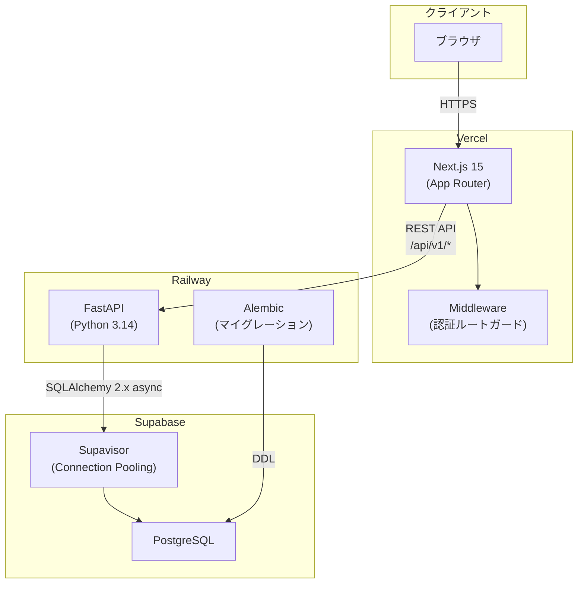
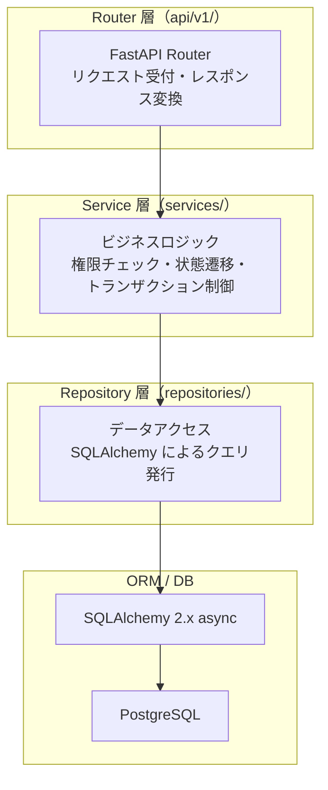
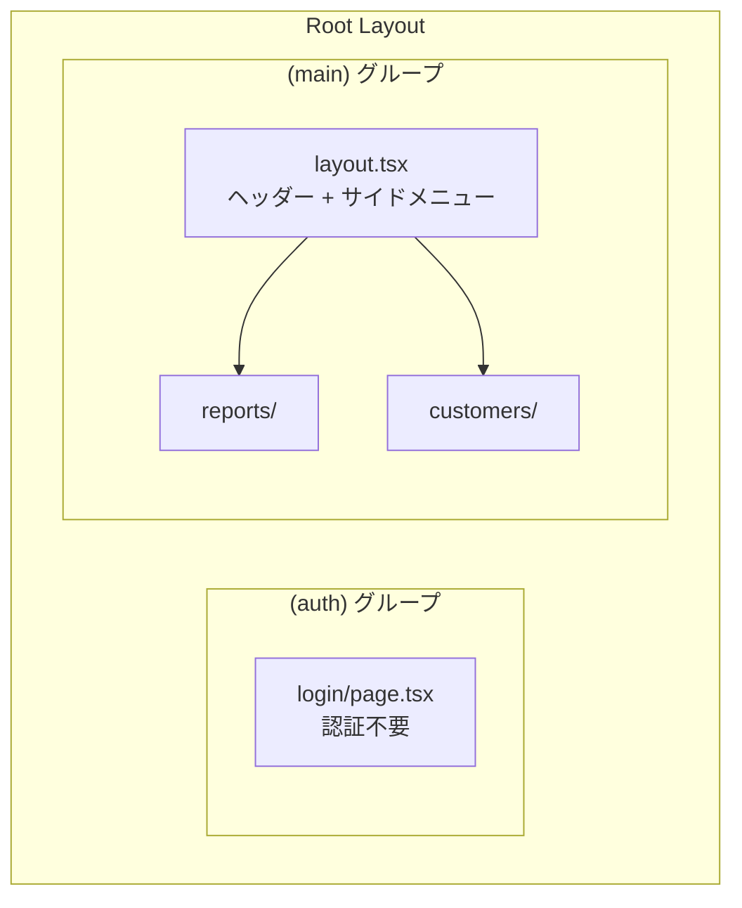
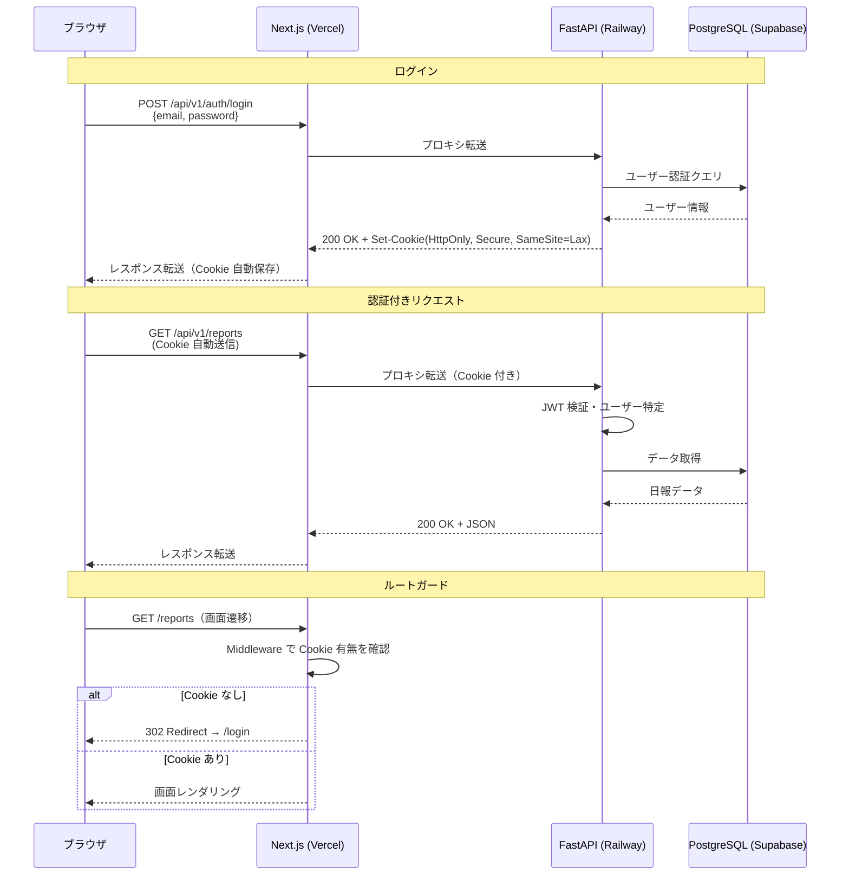
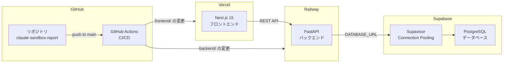
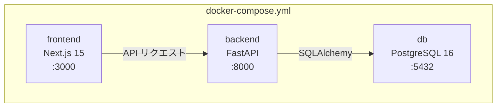
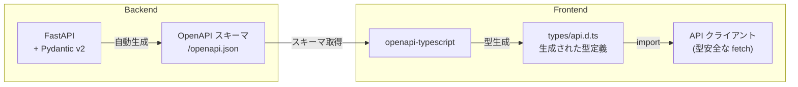
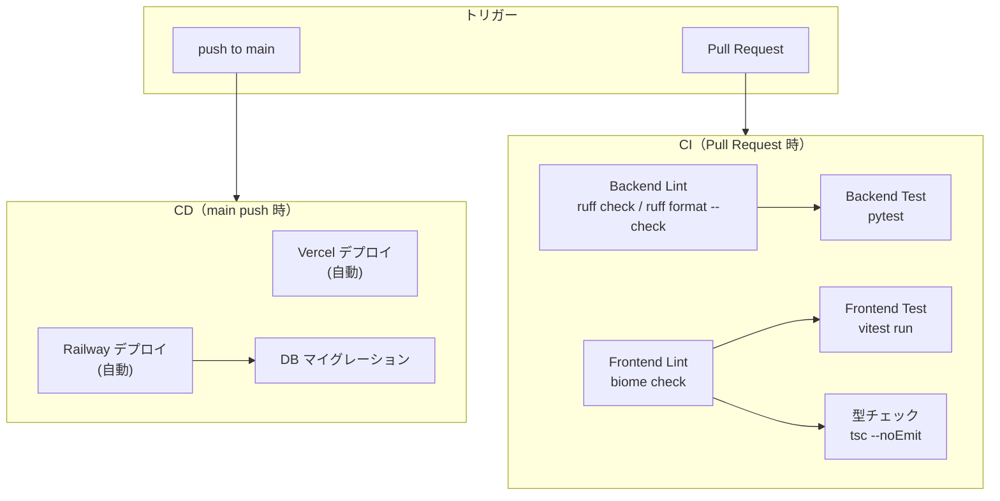

# アーキテクチャ設計書 — 営業日報システム

## 1. システム構成図



---

## 2. 技術スタック一覧

### インフラ

| 区分 | 選択 | 備考 |
| --- | --- | --- |
| FE ホスティング | Vercel | Next.js 公式推奨 |
| BE ホスティング | Railway | Python ネイティブ対応・Dockerfile デプロイ対応 |
| データベース | Supabase (PostgreSQL) | マネージド PostgreSQL・Supavisor によるコネクションプーリング |
| リポジトリ構成 | モノレポ | frontend/ と backend/ を同一リポジトリで管理 |
| CI/CD | GitHub Actions | lint・テスト・デプロイの自動化 |

### フロントエンド

| 区分 | 選択 | 備考 |
| --- | --- | --- |
| フレームワーク | Next.js 15 (App Router) | React Server Components 対応 |
| 言語 | TypeScript | 型安全性の確保 |
| UI コンポーネント | shadcn/ui | Tailwind CSS + Radix UI ベース |
| サーバー状態管理 | TanStack Query v5 | API データのキャッシュ・再取得・楽観的更新 |
| クライアント状態管理 | Jotai | 認証情報等の軽量なグローバル状態 |
| フォーム・バリデーション | React Hook Form + Zod | スキーマベースバリデーション |
| パッケージマネージャー | bun | 高速インストール・ランタイム |
| Linter / Formatter | Biome | Lint + Format を単一ツールで高速実行 |
| API 型自動生成 | openapi-typescript | OpenAPI スキーマからの型生成 |

### バックエンド

| 区分 | 選択 | 備考 |
| --- | --- | --- |
| 言語 | Python 3.14 | — |
| フレームワーク | FastAPI | 自動 OpenAPI スキーマ生成・非同期対応 |
| ORM | SQLAlchemy 2.x (async) | asyncpg ドライバによる非同期 DB 操作 |
| マイグレーション | Alembic | SQLAlchemy 連携の DB マイグレーション |
| バリデーション | Pydantic v2 | リクエスト/レスポンスのスキーマ定義 |
| パッケージ管理 | uv | 高速な依存解決・ロックファイル管理 |
| Linter / Formatter | Ruff | Python 用高速 Linter / Formatter |
| 認証 | JWT (httpOnly Cookie) | XSS 対策としてトークンを Cookie に保存 |

### テスト

| 区分 | 選択 | 備考 |
| --- | --- | --- |
| BE 単体・結合テスト | pytest | フィクスチャ・パラメタライズ対応 |
| FE 単体・結合テスト | Vitest + Testing Library | Jest 互換・高速実行 |
| E2E テスト | Playwright | テスト仕様書のシナリオテストに使用 |

### プロジェクト管理

| 区分 | 選択 | 備考 |
| --- | --- | --- |
| タスク管理 | GitHub Projects | カンバンボードでの進捗管理 |
| チケット管理 | GitHub Issues | 機能要件・バグのチケット化 |

---

## 3. ディレクトリ構成

```
claude-sandbox-report/
├── frontend/                        # Next.js アプリケーション
│   ├── src/
│   │   ├── app/                     # App Router（画面・ルーティング）
│   │   │   ├── (auth)/              # 認証不要グループ
│   │   │   │   └── login/
│   │   │   └── (main)/              # 認証必須グループ
│   │   │       ├── reports/
│   │   │       │   ├── page.tsx             # 日報一覧
│   │   │       │   ├── new/page.tsx         # 日報作成
│   │   │       │   └── [id]/
│   │   │       │       ├── page.tsx         # 日報詳細
│   │   │       │       └── edit/page.tsx    # 日報編集
│   │   │       └── customers/
│   │   │           ├── page.tsx             # 顧客一覧
│   │   │           ├── new/page.tsx         # 顧客登録
│   │   │           └── [id]/
│   │   │               └── edit/page.tsx    # 顧客編集
│   │   ├── components/              # UI コンポーネント
│   │   │   ├── ui/                  # 汎用コンポーネント（shadcn/ui）
│   │   │   └── features/            # 機能別コンポーネント
│   │   ├── hooks/                   # カスタムフック（API 呼び出し等）
│   │   ├── lib/                     # API クライアント・ユーティリティ
│   │   └── types/                   # 型定義（openapi-typescript 生成含む）
│   ├── package.json
│   ├── next.config.ts
│   ├── tailwind.config.ts
│   └── tsconfig.json
│
├── backend/                         # FastAPI アプリケーション
│   ├── app/
│   │   ├── api/
│   │   │   └── v1/
│   │   │       ├── auth.py          # 認証エンドポイント
│   │   │       ├── reports.py       # 日報エンドポイント
│   │   │       ├── customers.py     # 顧客エンドポイント
│   │   │       └── users.py         # ユーザーエンドポイント
│   │   ├── schemas/                 # Pydantic スキーマ（リクエスト/レスポンス）
│   │   ├── services/                # ビジネスロジック層
│   │   ├── repositories/            # データアクセス層
│   │   ├── models/                  # SQLAlchemy ORM モデル
│   │   └── core/                    # 設定・認証・依存注入
│   │       ├── config.py            # 環境変数・設定
│   │       ├── security.py          # JWT 認証ロジック
│   │       ├── database.py          # DB セッション管理
│   │       └── dependencies.py      # FastAPI Depends
│   ├── tests/                       # pytest テスト
│   ├── alembic/                     # DB マイグレーション
│   │   ├── versions/                # マイグレーションファイル
│   │   └── env.py
│   ├── alembic.ini
│   └── pyproject.toml
│
├── docs/                            # ドキュメント
│   ├── ARCHITECTURE.md              # アーキテクチャ設計書（本書）
│   ├── SCREEN_DESIGN.md             # 画面定義書
│   ├── API_SCHEME.md                # API 仕様書
│   ├── TEST_DEFINITION.md           # テスト仕様書
│   └── ER_DIAGRAM.md               # ER 図
│
├── docker-compose.yml               # ローカル開発用
├── .github/
│   └── workflows/                   # CI/CD ワークフロー
│       ├── ci.yml                   # lint・テスト
│       └── deploy.yml               # デプロイ
└── CLAUDE.md                        # プロジェクト指示書
```

---

## 4. バックエンド アーキテクチャ

### レイヤードアーキテクチャ

シンプルな 3 層構成を採用する。各層は単方向の依存関係を持ち、上位層から下位層のみを参照する。



### 各層の責務

| 層 | ディレクトリ | 責務 | 依存先 |
| --- | --- | --- | --- |
| Router | `api/v1/` | HTTP リクエスト/レスポンスの変換、Pydantic スキーマによるバリデーション | Service |
| Service | `services/` | ビジネスロジック（権限チェック・ステータス遷移・重複チェック）、トランザクション制御 | Repository |
| Repository | `repositories/` | DB 操作（CRUD）のみ。ビジネスロジックを含まない | ORM Model |
| Schema | `schemas/` | リクエスト/レスポンスの型定義（Pydantic v2） | — |
| Model | `models/` | DB テーブルと 1:1 対応する ORM モデル定義 | — |
| Core | `core/` | 横断的関心事（設定・認証・DB接続・依存注入） | — |

### 依存注入

FastAPI の `Depends` を活用し、各層の依存を注入する。

```python
# Router → Service → Repository の依存チェーン例
@router.get("/reports")
async def get_reports(
    service: ReportService = Depends(get_report_service),
    current_user: User = Depends(get_current_user),
):
    return await service.get_reports(current_user)
```

---

## 5. フロントエンド アーキテクチャ

### App Router 構成

Route Group を使って認証要否でレイアウトを分離する。



| Route Group | レイアウト | 認証 |
| --- | --- | --- |
| `(auth)` | ログイン専用レイアウト（ヘッダー・サイドメニューなし） | 不要 |
| `(main)` | 共通レイアウト（ヘッダー + サイドメニュー） | 必須（Middleware でルートガード） |

### 状態管理の方針

| 種別 | 管理方法 | 用途 |
| --- | --- | --- |
| サーバー状態 | TanStack Query v5 | API データのキャッシュ・再取得・楽観的更新 |
| クライアント状態 | Jotai | 認証ユーザー情報・UI の一時状態 |
| フォーム状態 | React Hook Form | 入力値・バリデーション状態・送信制御 |

### コンポーネント設計

```
components/
├── ui/                  # shadcn/ui ベースの汎用コンポーネント
│   ├── button.tsx
│   ├── input.tsx
│   ├── table.tsx
│   ├── dialog.tsx
│   ├── toast.tsx
│   └── ...
└── features/            # 機能ドメイン別コンポーネント
    ├── reports/
    │   ├── ReportTable.tsx
    │   ├── ReportForm.tsx
    │   ├── VisitRecordRow.tsx
    │   └── CommentSection.tsx
    └── customers/
        ├── CustomerTable.tsx
        └── CustomerForm.tsx
```

| 分類 | 配置 | 説明 |
| --- | --- | --- |
| 汎用 UI | `components/ui/` | shadcn/ui で生成。ビジネスロジックを持たない |
| 機能コンポーネント | `components/features/` | 特定の画面・機能に紐づくコンポーネント |
| ページコンポーネント | `app/` 配下の `page.tsx` | ルーティングと機能コンポーネントの組み合わせ |

---

## 6. 認証フロー

### JWT + httpOnly Cookie 方式

`localStorage` ではなく **httpOnly Cookie** にトークンを保存することで、XSS 攻撃によるトークン窃取を防止する。



### Cookie 設定

| 属性 | 値 | 理由 |
| --- | --- | --- |
| `HttpOnly` | `true` | JavaScript からのアクセスを防止（XSS 対策） |
| `Secure` | `true` | HTTPS 通信時のみ送信 |
| `SameSite` | `Lax` | CSRF 対策（トップレベルナビゲーション以外で送信しない） |
| `Path` | `/api` | API リクエスト時のみ Cookie を送信 |

---

## 7. デプロイ構成



### 環境変数の方針

| 環境 | 管理方法 |
| --- | --- |
| ローカル開発 | `.env` ファイル（`.gitignore` に追加） |
| Vercel | Vercel Dashboard の Environment Variables |
| Railway | Railway Dashboard の Variables |

| 変数名 | 設定先 | 説明 |
| --- | --- | --- |
| `DATABASE_URL` | Railway | Supabase PostgreSQL の接続文字列 |
| `SECRET_KEY` | Railway | JWT 署名用シークレットキー |
| `ALLOWED_ORIGINS` | Railway | CORS 許可オリジン（Vercel の URL） |
| `NEXT_PUBLIC_API_URL` | Vercel | バックエンド API のベース URL |

---

## 8. ローカル開発環境

Docker Compose を使用してローカル開発環境を構築する。



### サービス定義

```yaml
# docker-compose.yml
services:
  db:
    image: postgres:16
    environment:
      POSTGRES_USER: postgres
      POSTGRES_PASSWORD: postgres
      POSTGRES_DB: daily_report
    ports:
      - "5432:5432"
    volumes:
      - postgres_data:/var/lib/postgresql/data

  backend:
    build: ./backend
    environment:
      DATABASE_URL: postgresql+asyncpg://postgres:postgres@db:5432/daily_report
      SECRET_KEY: local-dev-secret-key
      ALLOWED_ORIGINS: http://localhost:3000
    ports:
      - "8000:8000"
    depends_on:
      - db
    volumes:
      - ./backend:/app

  frontend:
    build: ./frontend
    environment:
      NEXT_PUBLIC_API_URL: http://localhost:8000
    ports:
      - "3000:3000"
    depends_on:
      - backend
    volumes:
      - ./frontend:/app
      - /app/node_modules

volumes:
  postgres_data:
```

### 起動手順

```bash
# 初回起動
docker compose up --build

# 2回目以降
docker compose up

# DB マイグレーション
docker compose exec backend alembic upgrade head
```

---

## 9. OpenAPI 型自動生成

FastAPI が自動生成する OpenAPI スキーマを基に、フロントエンドの型定義を自動生成する。



### 型生成コマンド

```bash
# frontend/ ディレクトリで実行
bun run openapi-typescript http://localhost:8000/openapi.json -o src/types/api.d.ts
```

### メリット

- API のリクエスト/レスポンスの型を FE/BE で自動的に同期できる
- Pydantic スキーマの変更が即座にフロントエンドの型に反映される
- 型の手動メンテナンスが不要になり、型不整合によるバグを防止できる

---

## 10. CI/CD

GitHub Actions を使用して、lint・テスト・デプロイを自動化する。

### ワークフロー概要



### CI ワークフロー（Pull Request）

| ジョブ | 対象 | 実行内容 |
| --- | --- | --- |
| `lint-backend` | `backend/` | `ruff check .` / `ruff format --check .` |
| `lint-frontend` | `frontend/` | `biome check .` |
| `test-backend` | `backend/` | `pytest` (PostgreSQL サービスコンテナ使用) |
| `test-frontend` | `frontend/` | `vitest run` |
| `typecheck` | `frontend/` | `tsc --noEmit` |

### CD ワークフロー（main push）

| ステップ | 実行内容 |
| --- | --- |
| Vercel デプロイ | Vercel の GitHub Integration により `frontend/` の変更を自動デプロイ |
| Railway デプロイ | Railway の GitHub Integration により `backend/` の変更を自動デプロイ |
| DB マイグレーション | Railway のデプロイコマンドで `alembic upgrade head` を実行 |
