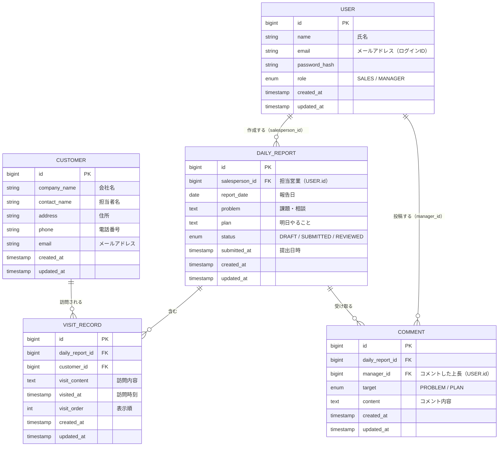

# ER図 — 営業日報システム

```mermaid
erDiagram
    USER {
        bigint id PK
        string name "氏名"
        string email "メールアドレス（ログインID）"
        string password_hash
        enum role "SALES / MANAGER"
        timestamp created_at
        timestamp updated_at
    }

    CUSTOMER {
        bigint id PK
        string company_name "会社名"
        string contact_name "担当者名"
        string address "住所"
        string phone "電話番号"
        string email "メールアドレス"
        timestamp created_at
        timestamp updated_at
    }

    DAILY_REPORT {
        bigint id PK
        bigint salesperson_id FK "担当営業（USER.id）"
        date report_date "報告日"
        text problem "課題・相談"
        text plan "明日やること"
        enum status "DRAFT / SUBMITTED / REVIEWED"
        timestamp submitted_at "提出日時"
        timestamp created_at
        timestamp updated_at
    }

    VISIT_RECORD {
        bigint id PK
        bigint daily_report_id FK
        bigint customer_id FK
        text visit_content "訪問内容"
        timestamp visited_at "訪問時刻"
        int visit_order "表示順"
        timestamp created_at
        timestamp updated_at
    }

    COMMENT {
        bigint id PK
        bigint daily_report_id FK
        bigint manager_id FK "コメントした上長（USER.id）"
        enum target "PROBLEM / PLAN"
        text content "コメント内容"
        timestamp created_at
        timestamp updated_at
    }

    USER ||--o{ DAILY_REPORT : "作成する（salesperson_id）"
    USER ||--o{ COMMENT : "投稿する（manager_id）"
    DAILY_REPORT ||--o{ VISIT_RECORD : "含む"
    DAILY_REPORT ||--o{ COMMENT : "受け取る"
    CUSTOMER ||--o{ VISIT_RECORD : "訪問される"
```
