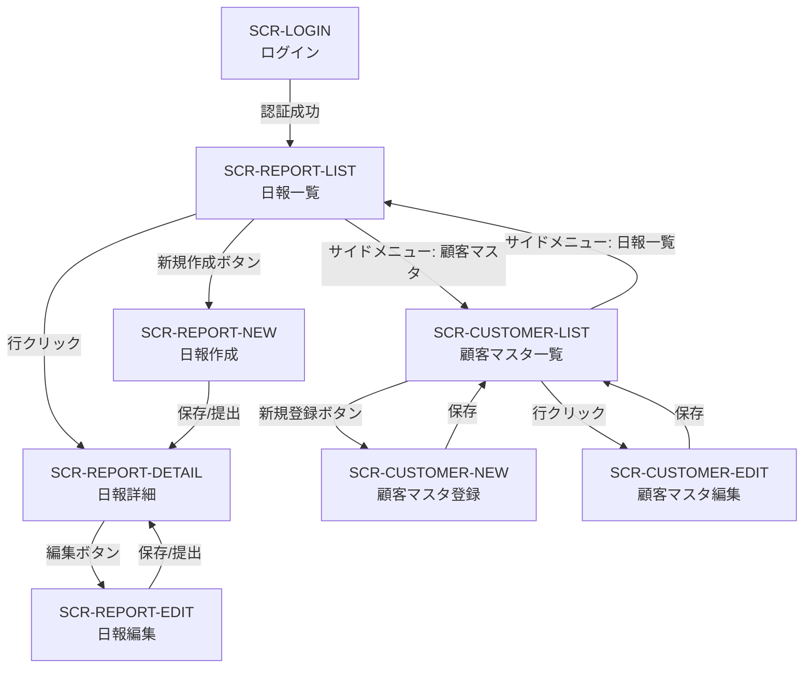

# 画面定義書 — 営業日報システム

## 画面一覧

| No. | 画面ID | 画面名 | URL パス | アクセス権限 |
| --- | --- | --- | --- | --- |
| 1 | SCR-LOGIN | ログイン | `/login` | 未認証ユーザー |
| 2 | SCR-REPORT-LIST | 日報一覧 | `/reports` | SALES / MANAGER |
| 3 | SCR-REPORT-NEW | 日報作成 | `/reports/new` | SALES |
| 4 | SCR-REPORT-EDIT | 日報編集 | `/reports/:id/edit` | SALES（本人のみ） |
| 5 | SCR-REPORT-DETAIL | 日報詳細 | `/reports/:id` | SALES（本人） / MANAGER |
| 6 | SCR-CUSTOMER-LIST | 顧客マスタ一覧 | `/customers` | SALES / MANAGER |
| 7 | SCR-CUSTOMER-NEW | 顧客マスタ登録 | `/customers/new` | SALES / MANAGER |
| 8 | SCR-CUSTOMER-EDIT | 顧客マスタ編集 | `/customers/:id/edit` | SALES / MANAGER |

---

## 画面遷移図



---

## 共通レイアウト

### ヘッダー

| 要素 | 表示条件 | 説明 |
| --- | --- | --- |
| システムロゴ / タイトル | 常時 | 「営業日報システム」を表示 |
| ログインユーザー名 | 認証済み | ユーザー氏名を表示 |
| ロールバッジ | 認証済み | 「営業」または「マネージャー」を表示 |
| ログアウトボタン | 認証済み | クリックでログアウト → ログイン画面へ遷移 |

### サイドメニュー

| メニュー項目 | 遷移先 | 表示条件 |
| --- | --- | --- |
| 日報一覧 | `/reports` | SALES / MANAGER |
| 顧客マスタ | `/customers` | SALES / MANAGER |

---

## 1. SCR-LOGIN — ログイン

### 概要

メールアドレスとパスワードで認証を行う画面。未認証時にすべてのURLからリダイレクトされる。

### レイアウトイメージ

```
┌──────────────────────────────────────┐
│          営業日報システム              │
│                                      │
│   ┌──────────────────────────────┐   │
│   │  メールアドレス               │   │
│   │  [ user@example.com        ] │   │
│   │                              │   │
│   │  パスワード                   │   │
│   │  [ ••••••••                ] │   │
│   │                              │   │
│   │       [ ログイン ]            │   │
│   │                              │   │
│   │  ⚠ エラーメッセージ表示領域    │   │
│   └──────────────────────────────┘   │
└──────────────────────────────────────┘
```

### 入力項目

| No. | 項目名 | 項目ID | 型 | 必須 | バリデーション |
| --- | --- | --- | --- | --- | --- |
| 1 | メールアドレス | `email` | text (email) | ○ | メール形式チェック |
| 2 | パスワード | `password` | password | ○ | 1文字以上 |

### ボタン

| ボタン名 | アクション | 備考 |
| --- | --- | --- |
| ログイン | POST 認証API → 成功時は日報一覧へ遷移 | バリデーション通過時のみ活性 |

### エラー表示

| 条件 | メッセージ |
| --- | --- |
| 認証失敗 | 「メールアドレスまたはパスワードが正しくありません」 |
| 未入力 | 各フィールド下に「入力してください」 |

---

## 2. SCR-REPORT-LIST — 日報一覧

### 概要

日報の一覧を表示する画面。営業担当者は自分の日報のみ、上長は全営業担当者の日報を閲覧できる。

### レイアウトイメージ

```
┌─────────────────────────────────────────────────────────────────┐
│ [ヘッダー]                                                       │
├────────┬────────────────────────────────────────────────────────┤
│        │  日報一覧                            [ + 新規作成 ]     │
│ サイド  │                                                        │
│ メニュー │  ┌─ 検索条件 ──────────────────────────────────────┐   │
│        │  │ 報告日: [FROM] 〜 [TO]  担当者: [▼]  ステータス: [▼] │   │
│        │  │                              [ 検索 ] [ クリア ] │   │
│        │  └──────────────────────────────────────────────────┘   │
│        │                                                        │
│        │  ┌────┬──────┬──────────┬──────────┬────────┬──────┐   │
│        │  │ No.│報告日 │ 担当者    │ 訪問件数  │ステータス│ 提出日 │   │
│        │  ├────┼──────┼──────────┼──────────┼────────┼──────┤   │
│        │  │  1 │05/20 │ 田中太郎  │    3     │ 提出済み │ 05/20│   │
│        │  │  2 │05/19 │ 田中太郎  │    2     │ 確認済み │ 05/19│   │
│        │  │  3 │05/18 │ 田中太郎  │    1     │ 下書き   │  -   │   │
│        │  └────┴──────┴──────────┴──────────┴────────┴──────┘   │
│        │                                                        │
│        │  < 1 2 3 ... 10 >                                      │
└────────┴────────────────────────────────────────────────────────┘
```

### 検索条件

| No. | 項目名 | 項目ID | 型 | 初期値 | 備考 |
| --- | --- | --- | --- | --- | --- |
| 1 | 報告日（FROM） | `date_from` | date | 当月1日 | — |
| 2 | 報告日（TO） | `date_to` | date | 本日 | — |
| 3 | 担当者 | `salesperson_id` | select | 全件 | MANAGER のみ表示。SALES は自分固定 |
| 4 | ステータス | `status` | select | 全件 | DRAFT / SUBMITTED / REVIEWED |

### 一覧表示項目

| No. | 項目名 | データソース | 表示形式 | ソート |
| --- | --- | --- | --- | --- |
| 1 | No. | 連番 | — | — |
| 2 | 報告日 | `DAILY_REPORT.report_date` | `MM/DD（曜日）` | ○（デフォルト降順） |
| 3 | 担当者 | `USER.name` | テキスト | ○ |
| 4 | 訪問件数 | `COUNT(VISIT_RECORD)` | 数値 | ○ |
| 5 | ステータス | `DAILY_REPORT.status` | バッジ表示（下書き / 提出済み / 確認済み） | ○ |
| 6 | 提出日時 | `DAILY_REPORT.submitted_at` | `MM/DD HH:mm` | ○ |

### ボタン

| ボタン名 | 表示条件 | アクション |
| --- | --- | --- |
| 新規作成 | SALES ロールのみ | 日報作成画面へ遷移 |
| 検索 | 常時 | 検索条件で一覧を絞り込み |
| クリア | 常時 | 検索条件を初期値にリセット |

### 行クリック

一覧の行をクリックすると日報詳細画面（`/reports/:id`）へ遷移する。

### ページネーション

1ページあたり20件表示。ページ番号による切替。

---

## 3. SCR-REPORT-NEW — 日報作成

### 概要

新規日報を作成する画面。訪問記録を複数件追加でき、Problem / Plan を入力して下書き保存または提出する。

### レイアウトイメージ

```
┌─────────────────────────────────────────────────────────────────┐
│ [ヘッダー]                                                       │
├────────┬────────────────────────────────────────────────────────┤
│        │  日報作成                                               │
│ サイド  │                                                        │
│ メニュー │  報告日: [ 2025/05/20 ]                                 │
│        │                                                        │
│        │  ── 訪問記録 ──────────────────────────────────────     │
│        │  ┌────┬──────────┬──────────────┬───────┬────┐        │
│        │  │ #  │ 顧客      │ 訪問内容      │ 訪問時刻 │ 削除 │        │
│        │  ├────┼──────────┼──────────────┼───────┼────┤        │
│        │  │ 1  │ [▼ 選択]  │ [テキスト    ]│ [HH:mm]│  🗑  │        │
│        │  │ 2  │ [▼ 選択]  │ [テキスト    ]│ [HH:mm]│  🗑  │        │
│        │  └────┴──────────┴──────────────┴───────┴────┘        │
│        │                              [ + 訪問記録を追加 ]       │
│        │                                                        │
│        │  ── Problem（課題・相談） ──────────────────────────     │
│        │  ┌──────────────────────────────────────────────┐      │
│        │  │ (テキストエリア)                                │      │
│        │  └──────────────────────────────────────────────┘      │
│        │                                                        │
│        │  ── Plan（明日やること） ───────────────────────────     │
│        │  ┌──────────────────────────────────────────────┐      │
│        │  │ (テキストエリア)                                │      │
│        │  └──────────────────────────────────────────────┘      │
│        │                                                        │
│        │       [ 下書き保存 ]    [ 提出 ]    [ キャンセル ]       │
└────────┴────────────────────────────────────────────────────────┘
```

### 入力項目

| No. | 項目名 | 項目ID | 型 | 必須 | バリデーション | 備考 |
| --- | --- | --- | --- | --- | --- | --- |
| 1 | 報告日 | `report_date` | date | ○ | 未来日不可。同日の日報が既に存在する場合はエラー | 初期値: 本日 |
| 2 | 顧客 | `visit_records[n].customer_id` | select | ○（訪問記録がある場合） | 顧客マスタから選択 | インクリメンタルサーチ対応 |
| 3 | 訪問内容 | `visit_records[n].visit_content` | textarea | ○（訪問記録がある場合） | 最大1000文字 | — |
| 4 | 訪問時刻 | `visit_records[n].visited_at` | time | ○（訪問記録がある場合） | — | — |
| 5 | Problem | `problem` | textarea | — | 最大2000文字 | — |
| 6 | Plan | `plan` | textarea | — | 最大2000文字 | — |

### 訪問記録の動的追加・削除

- 「+ 訪問記録を追加」ボタンで行を動的に追加（上限なし）
- 各行の削除ボタン（🗑）で該当行を削除（確認ダイアログあり）
- 訪問記録は0件でも保存可能

### ボタン

| ボタン名 | アクション | 備考 |
| --- | --- | --- |
| 下書き保存 | ステータス DRAFT で保存 → 日報詳細画面へ遷移 | バリデーション: 報告日のみ必須 |
| 提出 | ステータス SUBMITTED で保存 → 日報詳細画面へ遷移 | 全必須項目のバリデーションを実施。確認ダイアログあり |
| キャンセル | 日報一覧画面へ遷移 | 入力内容がある場合は確認ダイアログあり |

---

## 4. SCR-REPORT-EDIT — 日報編集

### 概要

既存の日報を編集する画面。レイアウト・入力項目は日報作成画面（SCR-REPORT-NEW）と同一。

### SCR-REPORT-NEW との差分

| 項目 | 差分内容 |
| --- | --- |
| 画面タイトル | 「日報編集」 |
| 初期表示 | 既存データをフォームにプリセット |
| 編集可能条件 | ステータスが DRAFT の場合のみ編集可能。SUBMITTED / REVIEWED の場合は閲覧のみ（日報詳細画面へリダイレクト） |
| 削除ボタン | DRAFT の場合のみ表示。確認ダイアログ後に削除 → 日報一覧へ遷移 |

### 追加ボタン

| ボタン名 | 表示条件 | アクション |
| --- | --- | --- |
| 削除 | DRAFT のみ | 確認ダイアログ → 日報を削除 → 日報一覧へ遷移 |

---

## 5. SCR-REPORT-DETAIL — 日報詳細

### 概要

日報の詳細情報を閲覧する画面。上長は Problem / Plan にコメントを投稿できる。

### レイアウトイメージ

```
┌─────────────────────────────────────────────────────────────────┐
│ [ヘッダー]                                                       │
├────────┬────────────────────────────────────────────────────────┤
│        │  日報詳細                     [ 編集 ] [ 一覧に戻る ]   │
│ サイド  │                                                        │
│ メニュー │  報告日: 2025/05/20（火）     担当者: 田中太郎           │
│        │  ステータス: [提出済み]         提出日時: 05/20 18:00     │
│        │                                                        │
│        │  ── 訪問記録 ──────────────────────────────────────     │
│        │  ┌────┬──────────┬──────────────────┬────────┐        │
│        │  │ #  │ 顧客      │ 訪問内容          │ 訪問時刻 │        │
│        │  ├────┼──────────┼──────────────────┼────────┤        │
│        │  │ 1  │ ○○株式会社│ 新規提案の打合せ   │ 10:00  │        │
│        │  │ 2  │ △△商事   │ 契約更新の確認     │ 14:00  │        │
│        │  └────┴──────────┴──────────────────┴────────┘        │
│        │                                                        │
│        │  ── Problem（課題・相談） ──────────────────────────     │
│        │  納期の調整が必要。先方から短縮の要望あり。                │
│        │                                                        │
│        │    💬 コメント (2件)                                     │
│        │    ┌──────────────────────────────────────────┐        │
│        │    │ 鈴木部長  05/20 19:30                     │        │
│        │    │ 一度先方と再調整しましょう。                 │        │
│        │    ├──────────────────────────────────────────┤        │
│        │    │ 鈴木部長  05/21 09:00                     │        │
│        │    │ 明日の会議で議題に上げます。                 │        │
│        │    └──────────────────────────────────────────┘        │
│        │    [ コメントを入力...               ] [ 投稿 ]         │
│        │                                                        │
│        │  ── Plan（明日やること） ───────────────────────────     │
│        │  ○○株式会社への見積り再作成。△△商事のフォローアップ。      │
│        │                                                        │
│        │    💬 コメント (0件)                                     │
│        │    [ コメントを入力...               ] [ 投稿 ]         │
│        │                                                        │
│        │                         [ 確認済みにする ]               │
└────────┴────────────────────────────────────────────────────────┘
```

### 表示項目

| No. | 項目名 | データソース | 表示形式 |
| --- | --- | --- | --- |
| 1 | 報告日 | `DAILY_REPORT.report_date` | `YYYY/MM/DD（曜日）` |
| 2 | 担当者 | `USER.name` | テキスト |
| 3 | ステータス | `DAILY_REPORT.status` | バッジ（下書き / 提出済み / 確認済み） |
| 4 | 提出日時 | `DAILY_REPORT.submitted_at` | `MM/DD HH:mm` |
| 5 | 訪問記録一覧 | `VISIT_RECORD` | テーブル形式 |
| 6 | Problem | `DAILY_REPORT.problem` | テキスト（改行保持） |
| 7 | Plan | `DAILY_REPORT.plan` | テキスト（改行保持） |
| 8 | コメント一覧 | `COMMENT` | Problem / Plan それぞれの下にリスト表示 |

### コメント入力（MANAGER のみ）

| No. | 項目名 | 項目ID | 型 | 必須 | バリデーション |
| --- | --- | --- | --- | --- | --- |
| 1 | コメント（Problem） | `comment_problem` | textarea | ○ | 最大1000文字 |
| 2 | コメント（Plan） | `comment_plan` | textarea | ○ | 最大1000文字 |

### ボタン

| ボタン名 | 表示条件 | アクション |
| --- | --- | --- |
| 編集 | SALES（本人）かつステータス DRAFT | 日報編集画面へ遷移 |
| 一覧に戻る | 常時 | 日報一覧画面へ遷移 |
| コメント投稿 | MANAGER かつステータス SUBMITTED 以降 | コメントを保存してリロード |
| 確認済みにする | MANAGER かつステータス SUBMITTED | ステータスを REVIEWED に更新。確認ダイアログあり |

---

## 6. SCR-CUSTOMER-LIST — 顧客マスタ一覧

### 概要

顧客マスタの一覧を表示する画面。検索・新規登録・編集が可能。

### レイアウトイメージ

```
┌─────────────────────────────────────────────────────────────────┐
│ [ヘッダー]                                                       │
├────────┬────────────────────────────────────────────────────────┤
│        │  顧客マスタ一覧                     [ + 新規登録 ]      │
│ サイド  │                                                        │
│ メニュー │  ┌─ 検索条件 ────────────────────────────────────┐     │
│        │  │ 会社名: [          ]  担当者名: [          ]   │     │
│        │  │                          [ 検索 ] [ クリア ]   │     │
│        │  └────────────────────────────────────────────────┘     │
│        │                                                        │
│        │  ┌────┬──────────┬──────────┬──────────┬──────────┐   │
│        │  │ No.│ 会社名    │ 担当者名  │ 電話番号  │ メール    │   │
│        │  ├────┼──────────┼──────────┼──────────┼──────────┤   │
│        │  │  1 │○○株式会社 │ 山田花子  │03-xxxx   │ y@xx.co  │   │
│        │  │  2 │△△商事    │ 佐藤次郎  │06-xxxx   │ s@xx.co  │   │
│        │  └────┴──────────┴──────────┴──────────┴──────────┘   │
│        │                                                        │
│        │  < 1 2 3 ... >                                         │
└────────┴────────────────────────────────────────────────────────┘
```

### 検索条件

| No. | 項目名 | 項目ID | 型 | 備考 |
| --- | --- | --- | --- | --- |
| 1 | 会社名 | `company_name` | text | 部分一致検索 |
| 2 | 担当者名 | `contact_name` | text | 部分一致検索 |

### 一覧表示項目

| No. | 項目名 | データソース | ソート |
| --- | --- | --- | --- |
| 1 | No. | 連番 | — |
| 2 | 会社名 | `CUSTOMER.company_name` | ○（デフォルト昇順） |
| 3 | 担当者名 | `CUSTOMER.contact_name` | ○ |
| 4 | 電話番号 | `CUSTOMER.phone` | — |
| 5 | メールアドレス | `CUSTOMER.email` | — |

### ボタン

| ボタン名 | アクション |
| --- | --- |
| 新規登録 | 顧客マスタ登録画面へ遷移 |
| 検索 | 検索条件で一覧を絞り込み |
| クリア | 検索条件を初期値にリセット |

### 行クリック

顧客マスタ編集画面（`/customers/:id/edit`）へ遷移する。

### ページネーション

1ページあたり20件表示。

---

## 7. SCR-CUSTOMER-NEW — 顧客マスタ登録

### 概要

新規顧客を登録する画面。

### レイアウトイメージ

```
┌─────────────────────────────────────────────────────────────────┐
│ [ヘッダー]                                                       │
├────────┬────────────────────────────────────────────────────────┤
│        │  顧客マスタ登録                                         │
│ サイド  │                                                        │
│ メニュー │  会社名 *       [ ○○株式会社              ]             │
│        │  担当者名 *     [ 山田花子                  ]             │
│        │  住所           [ 東京都千代田区...          ]             │
│        │  電話番号       [ 03-1234-5678              ]             │
│        │  メールアドレス  [ yamada@example.co.jp      ]             │
│        │                                                        │
│        │            [ 保存 ]        [ キャンセル ]                │
└────────┴────────────────────────────────────────────────────────┘
```

### 入力項目

| No. | 項目名 | 項目ID | 型 | 必須 | バリデーション |
| --- | --- | --- | --- | --- | --- |
| 1 | 会社名 | `company_name` | text | ○ | 最大200文字 |
| 2 | 担当者名 | `contact_name` | text | ○ | 最大100文字 |
| 3 | 住所 | `address` | text | — | 最大500文字 |
| 4 | 電話番号 | `phone` | tel | — | 電話番号形式 |
| 5 | メールアドレス | `email` | email | — | メール形式 |

### ボタン

| ボタン名 | アクション |
| --- | --- |
| 保存 | バリデーション → 顧客を登録 → 顧客マスタ一覧へ遷移（成功メッセージ表示） |
| キャンセル | 顧客マスタ一覧へ遷移（確認ダイアログあり） |

---

## 8. SCR-CUSTOMER-EDIT — 顧客マスタ編集

### 概要

既存顧客の情報を編集する画面。レイアウト・入力項目は顧客マスタ登録画面（SCR-CUSTOMER-NEW）と同一。

### SCR-CUSTOMER-NEW との差分

| 項目 | 差分内容 |
| --- | --- |
| 画面タイトル | 「顧客マスタ編集」 |
| 初期表示 | 既存データをフォームにプリセット |
| 削除ボタン | 追加表示。訪問記録で使用中の場合は削除不可（エラーメッセージ表示） |

### 追加ボタン

| ボタン名 | アクション |
| --- | --- |
| 削除 | 確認ダイアログ → 顧客を削除 → 顧客マスタ一覧へ遷移 |

### 削除時のエラー

| 条件 | メッセージ |
| --- | --- |
| 訪問記録で使用中 | 「この顧客は訪問記録で使用されているため削除できません」 |

---

## 共通仕様

### メッセージ表示

| 種別 | 表示方法 | 表示時間 |
| --- | --- | --- |
| 成功メッセージ | 画面上部にトースト（緑） | 5秒で自動消去 |
| エラーメッセージ | 画面上部にトースト（赤） | 手動で閉じるまで表示 |
| バリデーションエラー | 該当フィールド下に赤字表示 | 入力修正まで表示 |
| 確認ダイアログ | モーダルダイアログ | ユーザー操作まで表示 |

### レスポンシブ対応

| ブレークポイント | 挙動 |
| --- | --- |
| PC（1024px以上） | サイドメニュー常時表示 |
| タブレット（768px〜1023px） | サイドメニューをハンバーガーメニューに切替 |
| スマートフォン（767px以下） | テーブルを横スクロール対応。フォームは1カラム |

### ローディング

- API通信中はボタンを非活性にし、スピナーを表示する
- 一覧画面ではテーブル部分にスケルトンローディングを表示する
